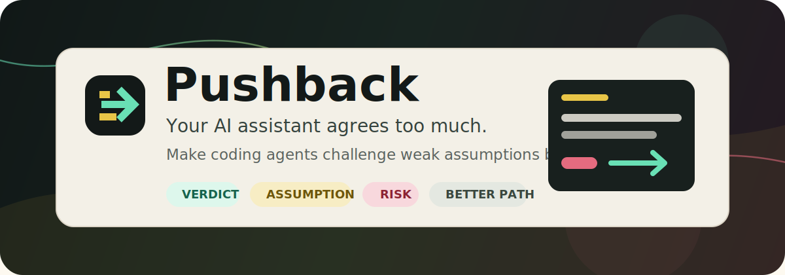

<div align="center">
  

  <p>
    <a href="https://github.com/amtildev/pushback/actions/workflows/validate.yml"></a>
    <a href="LICENSE"></a>
    
    
    
    
  </p>

  <p><strong>Your AI assistant agrees too much.</strong></p>
  <p>Pushback makes coding agents challenge weak assumptions before they agree, edit, delete, buy, ship, or publish.</p>
</div>

> [!IMPORTANT]
> New to Codex skills? You can still use Pushback today. Copy the universal prompt from [prompts/universal.md](prompts/universal.md), or install the multi-agent rule pack from [docs/agent-support.md](docs/agent-support.md).

## Why Pushback Exists

LLMs are tuned to be helpful, polite, and cooperative. That is useful until the assistant validates a bad premise, skips the hard question, or says "great idea" before checking the evidence.

`pushback` gives Codex a compact counterparty protocol:

| Instead of this | Pushback does this |
|---|---|
| "Sounds good, I will implement it." | Separates feasibility from judgment. |
| "Great idea." | Tests the hidden assumption first. |
| "I can do that." | Names the risk before action. |
| "Here is the plan." | Offers the smaller, safer, sharper path. |

> [!TIP]
> Use `$pushback` when agreement would be cheap but being wrong would be expensive.

## Quick Start

### Install It For Any Coding Agent

```bash
python scripts/install.py --target /path/to/your/project --agents all
```

This installs adapters for Codex, Claude Code, Cursor, Gemini CLI, GitHub Copilot, Cline, Roo Code, Kilo Code/KiloClaw, Hermes, OpenCode, OpenClaw-style agents, Windsurf, and Aider.

### Use It In Codex

```text
Use $pushback to challenge this plan before we do it.
```

### Use It Anywhere Else

Copy the short prompt:

```text
Push back before agreeing. Give a verdict, test my hidden assumption, name the real risk, and offer a better path. Do not be contrarian for show.
```

For the full version, see [prompts/universal.md](prompts/universal.md).

## Works With

| Agent or tool | Pushback support |
|---|---|
| Codex | `skills/pushback/`, `AGENTS.md` |
| Claude Code | `CLAUDE.md` |
| Cursor | `.cursor/rules/pushback.mdc`, `.cursorrules` |
| Gemini CLI | `GEMINI.md` |
| GitHub Copilot | `.github/copilot-instructions.md` |
| Cline | `.clinerules/pushback.md`, `AGENTS.md` |
| Roo Code | `.roo/rules/pushback.md`, `AGENTS.md` |
| Kilo Code / KiloClaw | `kilo.jsonc`, `.kilo/rules/pushback.md` |
| Hermes Agent | `.hermes.md`, `AGENTS.md` |
| OpenCode | `AGENTS.md` |
| OpenClaw-style agents | `AGENTS.md`, `SOUL.md` |
| Windsurf | `.windsurfrules` |
| Aider | `CONVENTIONS.md` |
| Anything else | [prompts/universal.md](prompts/universal.md) |

Full details: [docs/agent-support.md](docs/agent-support.md).

## Install The Codex Skill

Clone or download this repo, then copy the skill folder into your Codex skills directory.

```powershell
Copy-Item -Recurse -Force .\skills\pushback "$env:USERPROFILE\.codex\skills\pushback"
```

On macOS or Linux:

```bash
mkdir -p ~/.codex/skills
cp -R ./skills/pushback ~/.codex/skills/pushback
```

If your Codex skill installer supports GitHub paths, point it at:

```text
skills/pushback
```

## Use Cases

Invoke it when you want a real counterparty:

```text
Use $pushback to sanity-check this plan before implementing it.
```

```text
Use $pushback. Be direct: what is weak about this product idea?
```

```text
Use $pushback before touching production. Inspect first, then tell me the risk.
```

## What Changes

| Default assistant | With Pushback |
|---|---|
| "This sounds like a strong direction. I can implement it." | "Partly. The implementation is possible, but the premise is weak because the repo has no evidence users need this flow. The smallest useful test is to instrument the existing path before adding a new one." |

More examples: [demo/before-after.md](demo/before-after.md).

## Good Use Cases

| Area | What Pushback should catch |
|---|---|
| Product ideas | Distribution gaps, fake urgency, weak demand signals |
| Architecture | Complexity, lock-in, migration risk, maintainability cost |
| Code changes | Edge cases, regressions, missing tests, pattern drift |
| Risky operations | Destructive commands, live systems, secrets, recurring billing |
| Launch plans | Unclear audience, weak proof, vague success criteria |

## Not For

- Making the agent rude
- Generating objections for their own sake
- Bypassing model safety behavior
- Replacing real domain experts for legal, medical, financial, or security decisions

## Share It

If Pushback saves you from one bad plan, share it with someone whose AI assistant agrees too quickly.

- Social card: [assets/social-card.svg](assets/social-card.svg)
- Ready-to-post launch copy: [launch/social-posts.md](launch/social-posts.md)
- Submission targets: [launch/submission-targets.md](launch/submission-targets.md)

## Project Layout

```text
pushback/
  .clinerules/pushback.md
  .cursor/rules/pushback.mdc
  .github/copilot-instructions.md
  .hermes.md
  .kilo/rules/pushback.md
  .roo/rules/pushback.md
  .windsurfrules
  AGENTS.md
  CLAUDE.md
  GEMINI.md
  CONVENTIONS.md
  SOUL.md
  assets/
    banner.svg
    mark.svg
    social-card.svg
  demo/
    before-after.md
  launch/
    social-posts.md
    submission-targets.md
  prompts/
    universal.md
  rules/
    pushback.md
  scripts/
    install.py
  skills/pushback/
    SKILL.md
    agents/openai.yaml
  examples/
    prompts.md
  tests/
    validate_skill.py
```

## Validate

Run the project validator:

```bash
python tests/validate_skill.py .
```

If you have the Codex skill creator tools locally, you can also run:

```powershell
python "$env:USERPROFILE\.codex\skills\.system\skill-creator\scripts\quick_validate.py" ".\skills\pushback"
```

## Contributing

Good contributions make the skill more truth-seeking without making it abrasive. Improve specific decision rules, add realistic examples, or tighten wording that causes false pushback.

## License

MIT. See [LICENSE](LICENSE).
